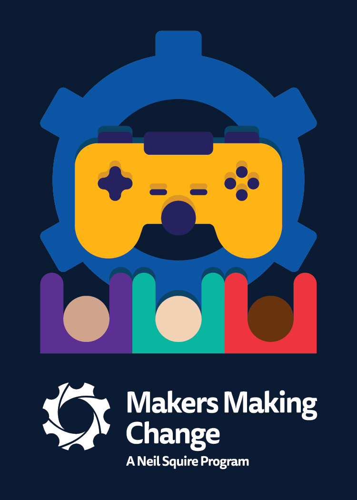

 
# This README is under development 
Some links might not work and we are trying things out as we continue to launch these resources. However, this is an public GitHub as the current checkpoints need access to these digital documents. Thank you for your paitence :)

# GAME Checkpoints (Gaming Accessibility Made for Everyone)

## SUMMARY 
The GAME Checkpoints project pilot spanned from October 2022 - March 2023. We worked with clincial, education, and game development organizations to establish adaptive gaming spaces within their organization. This increased the ability for gamers to access assitive technology around gaming and test out technology relevant to them with experts while also educating the Checkpoint leads on accessibility in gaming.

The files contained on this page are the resources that were given to the centers. These includes 6 part booklet reference booklets, full list of materials delivered, and questionaires to work with gamers who are looking to test our various assitive technology/gaming options.
 

## More MMC gaming content at:
- [Makers Making Change "Adaptive Gaming Resources"](<https://makersmakingchange.com/resources/?&_sft_resource_category=adaptive-gaming>)
- [Makers Making Change Gaming Devices](<https://makersmakingchange.com/assistive-devices/?_sft_type=gaming>)

## How do I use these resources?

This is an open-source assistive technology, so anyone is free to utilize the content that is found on this page. An explanation of the content and link to the files can be seen below:

### GAME Checkpoint Reference Guides
A 6 part booklet series that is intended to be use as a tool by the centers to be a quick reference of revlevant information.

### Gamer Questionnaires

### Materials and Devices

### Templates

## Files
### Documentation
| Document             | Version | Link |
|----------------------|---------|------|
| Design Rationale     | 1.0     | [DeviceName_Design_Rationale](/Documentation/Device-Name_Design_Rationale_v1.0.pdf)     |
| Maker Guide          | 1.0     | [DeviceName_Maker_Checklist](/Documentation/Device-Name_Maker_Guide_v1.0.pdf)     |
| Bill of Materials    | 1.0     | [DeviceName_Bill_of_Materials](/Documentation/Device-Name_BOM_v1.0.xlsx)     |
| User Guide           | 1.0     | [DeviceName_User_Guide](/Documentation/Device-Name_Quick_Guide_v1.0.pdf)    |
| Changelog            | 1.0     | [DeviceName_Changelog](/Documentation/Device-Name_Changelog_v1.0.pdf)     |

## Attribution
Makers Making Change
 - Tyler Fentie 
 - Josie Versloot

## License
Everything needed or used to design, make, test, or prepare the <Device-Name> is licensed under the CERN 2.0 Permissive license <https://ohwr.org/project/cernohl/wikis/Documents/CERN-OHL-version-2> (CERN-OHL-P).

Accompanying material such as instruction manuals, videos, and other copyrightable works that are useful but not necessary to design, make, test, or prepare the <Device-Name> are published under a Creative Commons Attribution-ShareAlike 4.0 license https://creativecommons.org/licenses/by-sa/4.0/ (CC BY-SA 4.0).

---

## About Makers Making Change

Makers Making Change is an initiative of [Neil Squire](https://www.neilsquire.ca/), a Canadian non-profit that uses technology, knowledge, and passion to empower people with disabilities.

Makers Making Change is committed to creating and cultivating a network of volunteer makers who support people with disabilities in their communities through cost-effective Open Assistive Technology. MMC hosts a library of free, open-source designs complete with parts lists and build instructions.

 - Website: [www.MakersMakingChange.com](https://www.makersmakingchange.com/)
 - GitHub: [https://github.com/makersmakingchange](https://github.com/makersmakingchange)
 - Twitter: [@makermakechange](https://twitter.com/makermakechange)
 - Instagram: [@makersmakingchange](https://www.instagram.com/makersmakingchange)

### Contact

For technical questions, to get involved, or share your experience we encourage you to visit the [MMC Website](https://www.makersmakingchange.com/), [MMC Forum](https://makersmakingchange.com/forum), or contact info@makersmakingchange.com

