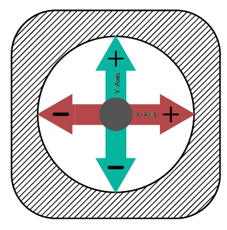
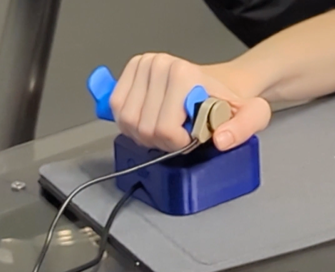
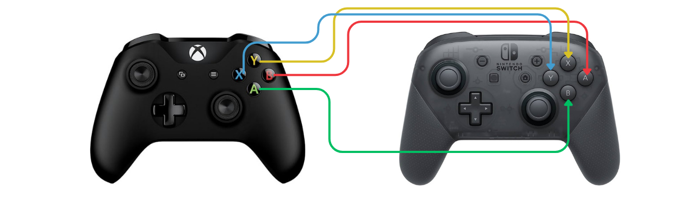
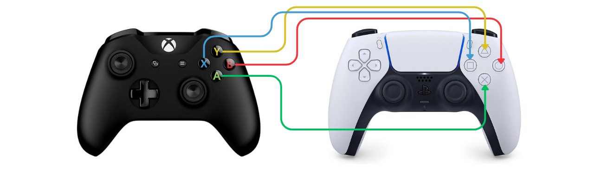

# Tips and Tricks

<button onclick="window.print()" class="print-button">
  Printable Version of this Section
</button>

There are many small decisions that can make or break an adaptive gaming setup. Over time, players, clinicians, and assistive technology specialists have developed practical strategies that improve access, comfort, and overall experience.

This section captures a mix of proven approaches and commonly shared tips. Treat these as flexible ideas—what works for one player may not work for another.

---

## Player Independence

Do not overlook system and menu navigation. Being able to independently start, pause, and navigate a game can significantly increase a player’s sense of control and confidence. Here are some common things to consider when thinking about a players independance.

* Ensure the player can:
    * Turn the console on/off
    * Launch a game
    * Pause or exit gameplay
* Place “non-critical” actions (menu, pause, home) on less "easy to activate" inputs if needed. Prioritize the reaction speed for inputs more relevant to the game.
    * Use features like **Shift Mode (XAC)** to add secondary functions without increasing the amount of hardware or inputs. Think, a switch could have the shift function to be "switch profiles" but A in its primary mapping.
* Consider accessibility features built into the system (e.g., remapping, shortcuts)

---

## Gamer Experience

Fatigue, frustration, and enjoyment matter just as much as technical success.

Gaming should not feel like a workout (unless that is the rehabilitaiton goal) or cause pain.

**Tips:**

* Monitor for:
    * Fatigue
    * Strain
    * Frustration
* Take breaks early—don’t wait until the player is exhausted
* Reduce force requirements where possible (lighter switches, lower joystick tension)
* Consider alternative mounting locations for the assistive tech to reduce strain.

**Important mindset:**

The experience the gamer wants does not need to match their current ability.

* Start with the **desired experience**, not just what is easiest to create a setup for.
* If a player wants to play a more complex game:
    * Build toward it
    * Use assistive tech to expand access
* Avoid forcing players into games just because the game is “simpler”

For example, if someones gaming goal is to play Call of Duty and they only like first person shooter games, creating a setup that only works for pinball may be a great start, but that is not where the journey should end.

---

## Joystick Related

Tips and strategies when working with joysticks.

### Accessing Two Joysticks from a Single Joystick

Many games require two joysticks, but not all players can physically access both.

There are ways to extend a **single joystick** to cover more functions.

**Here are Three Tricks for This:**

    
    
Top Down View of an Oak Joystick with Axis Shown

Check out the video detailing the three methods:

    <iframe 
        src="https://www.youtube.com/embed/MMPzwUI5oaA?si=IDNLRTun5YrNOeo3" 
        frameborder="0" 
        allowfullscreen>
    </iframe>

  
  
Video: Convert 2 Joysticks Into 1 Joystick

1. **X Axis Switching (XAC)**
    * Using the XAC and Xbox Accessories App, swap the X axis on the left joystick with the right joystick
    * This will allow you to move forwards and backwards while using left and right to control the direction of the character.

2. **Shift Mode (XAC)**
    * Use the primary mode for one joystick and the shift mode for the other. 
    * Use an assistive switch in either toggle or regular shift mode to swap between using the left or right joystick.

3. **“Walk Forward” Button**
    * Map forward movement to a button
    * Use joystick for camera movement to control direction (typically right joystick)
    * **Can sometimes be done inGame Settings**
        * Look for:
            * Auto-run
            * Camera assist
            * Reduced need for dual-stick control

SpecialEffect has created a fantastic resource for this: 

    <iframe 
        src="https://www.youtube.com/embed/g3-x46Uc2kk?si=EH2awS2uhmJjWadw" 
        frameborder="0" 
        allowfullscreen>
    </iframe>

  
  
Video: Special Effect - walk forward

---

### Using a Mouth Joystick

A mouth joystick can be a powerful addition to a setup.

**Benefits:**

* Adds an additional joystick input
* If you have switch or joystick access below your neck, it frees more access to:
    * Buttons
    * Switches
    * A second joystick
* Can reduce complexity of hand-based inputs

**Use cases:**

* Players with limited hand mobility
* Players who need access to a second joystick but have no more inputs available below their neck.
* Players with no movement below their neck.

---

### Mounting Assistive Switches on Joysticks

Switches can be mounted directly onto joysticks or toppers to enable quick access actions.

**Methods:**

* Hook and loop fastner
* Moldable plastic
* Custom 3D printed mounts

**Benefits:**

* Faster activation for frequent actions
* Reduced reach distance
* Better integration of controls

**Example:**

    
    
Raindrop Switch Mounted on the Side of an Oak Joystick Topper

---

## Utilizing Shift Mode on the Xbox Adaptive Controller (XAC)

Shift Mode allows a single input to perform multiple functions depending on whether a “shift” button is held.

**Benefits:**

* Doubles the number of available inputs without adding hardware
* Reduces physical reach requirements
* Allows layering of controls (primary vs secondary actions)

**Common uses:**

* Switching between movement and camera control on a joystick
* Adding menu/navigation functions
* Expanding limited switch setups. You can effectivly double your inputs by adding a shift mode to them.

**Considerations:**

* Ensure the player understands when Shift is active
* Avoid overly complex mappings
* Test for cognitive load and usability

---

## Using the Xbox Adaptive Controller on the Nintendo Switch 1 or 2

### How to Connect

We typically use the [**Mayflash Magic-NS 2**](https://www.mayflash.com/product/magic_ns_2.html) adapter to get the Xbox Adaptive Controller (XAC) working on the Nintendo Switch. See more in the [Alternative Access section](alt-access.md#adapters).

  
  
Link: Mayflash

For instructions on connecting the XAC to the Nintendo Switch (it is the same on the Nintendo Switch 2), please seee this video below.

    <iframe 
        src="https://www.youtube.com/embed/g3-x46Uc2kk?si=EH2awS2uhmJjWadw" 
        frameborder="0" 
        allowfullscreen>
    </iframe>

  
  
Video: How to setup XAC on Nintendo Switch

### How to Remap The controls of the XAC

There are two main ways to remap 

1. In the Nintendo Switch settings
    * In the settings of the Nintendo Switch, you will find the option to change the button mapping in the [controller settings](https://en-americas-support.nintendo.com/app/answers/detail/a_id/49229/~/how-to-change-the-button-mapping-on-nintendo-switch-controllers)
2. In the Xbox Accessories App using PC or Xbox
    * If you create a profile in the Xbox Accessories App it will be saved to the XAC itself. So when you go back and use it with the Nintendo Switch, the up to three saved profiles will be available.
    * See more about this in the [Xbox Adaptive Controller Section](alt-access.md#xbox-adaptive-controller-xac)

  
  
Link: Nintendo Controller Settings

---

### Using 2 controllers as one (controller assist) on Nintendo Switch 1|2

The Nintendo Switch 1|2 do not have a direct "controller assist" or "assist controller" mode where you can use two or more controllers as one. However, there is a method to do this using the Mayflash NS 2 adapter. This would allow you to: 

* Combine:
    * XAC + Nintendo Pro Controller
    * XAC + single Joy-Con
    * XAC + double Joy-Con
    * Joy-Con + Nintendo Pro Controller

**Instructions:**

See the video tutorial below to see how to set this up:

    <iframe 
        src="https://www.youtube.com/embed/lsdcLmnxgs4?si=FtmffEiip6aTuhdg" 
        frameborder="0" 
        allowfullscreen>
    </iframe>

  
  
Video: How to Copilot on Switch

---

### Why are the Buttons Swapped?

Button layouts differ between systems, which can cause confusion. For example, when you press A, B, X, or Y buttons on the XAC or they do not directly correlate to the A, B, X, and Y buttons on the Nintendo Switch. This is because, on the standard controller, the buttons are placed in **differnt locations**. See the photo below. 

    
    
Comparison of the Placement of Buttons on Xbox vs Nintendo Switch

Therefore: 

Xbox Buttons and What They do When Used on the Nintendo Switch
 

| Xbox | Nintendo Switch |
| :--- | :--- |
| A | B | 
| B | A | 
| Y | X | 
| X | Y | 

**Quick fix:**

* Hold **Pause (menu button) + A for ~3 seconds** (adapter dependent) on the XAC
* This swaps inputs to match expected layout.

**Tip:**

Always test button mapping before starting gameplay. You can do this through the [test input devices](https://en-americas-support.nintendo.com/app/answers/detail/a_id/22451/~/how-to-test-the-controller-buttons-on-nintendo-switch) on the Nintendo Switch.

  
  
Link: Test Inputs

---

## Adapters and the Button Layout Problem

Adapters can introduce confusion in button mapping. For example, if you are using an Xbox controller like the XAC on the PlayStation 5, there is no Square on the Xbox controller, so which assistive switch port on the XAC would you plug an assistive switch into to use as square on the PS5? This is what this tip will help with.

Different systems use different layouts:

* Xbox: A, B, X, Y  
* Nintendo: A, B , X, Y  (but in a different location on the controller)
* PlayStation: Cross, Circle, Square, Triangle  

**Key Tip:**

Do not rely on button labels—focus on **physical position**.

* Think in terms of:
    * Bottom button
    * Right button
    * Left button
    * Top button

See the images below to compare the location of the inputs of the Nintendo and PlayStation controllers against the Xbox controller.

    
    
Comparison of the Placement of Buttons on Xbox vs Nintendo Switch

    
    
Comparison of the Placement of Buttons on Xbox vs PlayStation

Xbox Buttons and What They do When Used on the Nintendo Switch and PlayStation
 

| Xbox | Nintendo Switch | PlayStation |
| :--- | :--- | :--- |
| A | B | Cross |
| B | A | Circle |
| Y | X | Triangle |
| X | Y | Square |

---
## One Handed Gaming
There are many ways to create a one-handed gaming setup, and it is one of the most common requests we receive. Because every person's abilities, goals, and gaming preferences are different, there is no single solution that works for everyone.

One-handed gaming can range from a player using one unaffected hand with typical dexterity to someone who has limited movement and uses only a single finger. The best setup depends on factors such as range of motion, strength, endurance, the types of games being played, and the platform being used. It is often helpful to start by identifying which inputs are difficult to access and which inputs are already available. This can make it easier to select the most effective combination of hardware, software, and controller modifications.

Below are some of the most common one-handed gaming solutions we recommend:

### Xbox Adaptive Controller (XAC) for One-Handed Play

The XAC is a versatile central hub compatible with Xbox, PC, and mobile platforms. 

**Benefits:**

* **Co-Pilot Mode:** Pair it with a standard controller to allow two devices to function as a single unit.
* **Expandability:** Features 19 3.5mm jacks for external switches and joysticks.
* **Cost Efficiency:** While the base unit is ~$115 CAD, using Makers Making Change (MMC) DIY switches can reduce accessory costs by up to 94% compared to commercial alternatives.

**Recommended Add-ons:**

* Pair with a mouth joystick like the **LipSync** or **QuadStick** (which features sip-and-puff and gamepad modes) for comprehensive control.

---

### Azeron Controller

The Azeron is a one-handed keypad and mouse alternative that keeps all necessary inputs within a small reach radius.

**Benefits:**

* Ergonomic keypad layout
* Significant reduction in hand movement required
* Highly customizable finger placement

**Recommended Version:**

* The **Azeron Cyro** is the preferred version if the player requires two joysticks combined with keyboard inputs.

**Cost:**

* Typically around $200 USD.

---

### 3D-Printed One-Handed Controller Mods

These are specialized shells that allow standard controllers (Xbox, PlayStation, Nintendo) to be operated with one hand.

**Compatibility:**

* **PC/Mobile:** Works seamlessly if the game supports standard controller input.
* **Console:** Requires the controller to match the system, or an adapter if using a different brand.
* **Resource:** Use [Gaming Readapted’s Controller Connect Tool](https://gamingreadapted.com/) to find the correct adapter for your setup.

**Cost:**

* Typically <$10 CAD for parts (plus printing/assembly).

---

### Cephable (Software)

A free, powerful application for PC and mobile that turns natural movements into game inputs.

**Input Methods:**

* Voice commands
* Facial expressions
* Head tracking
* Virtual on-screen buttons

**Benefits:**

* Adds layers of control without the need for additional physical hardware.

---

### Proteus Controller

A premium, fully modular gaming controller designed specifically for accessibility.

**Key Features:**

* Swappable components to match individual physical needs
* Configurations specifically documented for one-handed users

**Cost:**

* $400–$470 CAD

