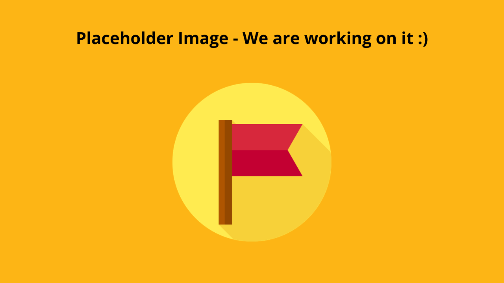

# Tips and Tricks

<button onclick="window.print()" class="print-button">
  Printable Version of this Section
</button>

There are many small decisions that can make or break an adaptive gaming setup. Over time, players, clinicians, and assistive technology specialists have developed practical strategies that improve access, comfort, and overall experience.

This section captures a mix of proven approaches and commonly shared tips. Treat these as flexible ideas—what works for one player may not work for another.

---

## Player Independence

Do not overlook system and menu navigation. Being able to independently start, pause, and navigate a game can significantly increase a player’s sense of control and confidence.

**Tips:**

* Ensure the player can:
  * Turn the console on/off
  * Launch a game
  * Pause or exit gameplay
* Map these functions to **easy-to-reach inputs**
* Place “non-critical” actions (menu, pause, home) on less accessible switches if needed
* Use features like **Shift Mode (XAC)** to add secondary functions without increasing hardware
* Consider accessibility features built into the system (e.g., remapping, shortcuts)

---

## Gamer Experience

Fatigue, frustration, and enjoyment matter just as much as technical success.

Gaming should not feel like a workout or cause pain.

**Tips:**

* Monitor for:
  * Fatigue
  * Strain
  * Frustration
* Take breaks early—don’t wait until the player is exhausted
* Reduce force requirements where possible (lighter switches, lower joystick tension)

**Important mindset:**

The experience the gamer wants does not need to match their current ability.

* Start with the **desired experience**, not just what is easiest to control
* If a player wants to play a more complex game:
  * Build toward it
  * Use assistive tech to expand access
* Avoid forcing players into games just because they are “simpler”

---

## Joystick Related

Tips and strategies when working with joysticks.

---

### Accessing Two Joysticks

Many games require two joysticks, but not all players can physically access both.

There are ways to extend a **single joystick** to cover more functions.

**Options:**

* **Axis Switching (XAC)**
  * Swap joystick axis to control different directions as needed

    
    
This is just a placeholder image

* **Shift Mode (XAC)**
  * Use one joystick for multiple functions depending on mode

    
    
This is just a placeholder image

* **“Walk Forward” Button**
  * Map forward movement to a button
  * Use joystick for direction only
  * **Can sometimes be done inGame Settings**
    * Look for:
      * Auto-run
      * Camera assist
      * Reduced need for dual-stick control

    
    
This is just a placeholder image

---

### Using a Mouth Joystick

A mouth joystick can be a powerful addition to a setup.

**Benefits:**

* Adds an additional joystick input
* Frees up hands for:
  * Buttons
  * Switches
* Can reduce complexity of hand-based inputs

**Use cases:**

* Players with limited hand mobility
* Players already using switches who need joystick control

    
    
This is just a placeholder image

---

### Mounting Assistive Switches on Joysticks

Switches can be mounted directly onto joysticks or toppers to enable quick access actions.

**Methods:**

* Hook and loop (Velcro)
* Moldable plastic (e.g., Sugru)
* Custom 3D printed mounts

**Benefits:**

* Faster activation for frequent actions
* Reduced reach distance
* Better integration of controls

**Example:**

    
    
This is just a placeholder image

---

## Utilizing Shift Mode on the Xbox Adaptive Controller (XAC)

Shift Mode allows a single input to perform multiple functions depending on whether a “shift” button is held.

**Benefits:**

* Doubles the number of available inputs without adding hardware
* Reduces physical reach requirements
* Allows layering of controls (primary vs secondary actions)

**Common uses:**

* Switching between movement and camera control
* Adding menu/navigation functions
* Expanding limited switch setups

**Considerations:**

* Ensure the player understands when Shift is active
* Avoid overly complex mappings
* Test for cognitive load and usability

    
    
This is just a placeholder image

---

## Using the Xbox Adaptive Controller on the Nintendo Switch

### How to Connect

When using adapters like the **Mayflash Magic-NS 2**, the Xbox Adaptive Controller can be used on the Nintendo Switch. See more in the [Alternative Access section](alt-access.md#adapters)

### How to Remap

* in Nintendo switch
* In xbox accessories still using spare PC or Xbox

    
    
This is just a placeholder image

---

### Pseudo Controller Assist Mode

The Nintendo Switch allows two controllers to act as one.

**Use this to:**

* Combine:
  * XAC + standard controller
  * XAC + Joy-Con
* Allow support person to assist if needed

**Instructions:**

[Insert step-by-step instructions here]

    
    
This is just a placeholder image

---

### Making Sure A is A and B is B

Button layouts differ between systems, which can cause confusion.

On Nintendo:
* A/B are reversed compared to Xbox

**Quick fix:**

* Hold **Pause + A for ~3 seconds** (adapter dependent)
* This swaps inputs to match expected layout

**Tip:**

Always test button mapping before starting gameplay.

---

## Adapters and the Button Layout Problem

Adapters allow cross-platform play, but they can introduce confusion in button mapping.

Different systems use different layouts:

* Xbox: A, B, X, Y  
* Nintendo: A, B (reversed), X, Y  
* PlayStation: X, O, Square, Triangle  

**Key Tip:**

Do not rely on button labels—focus on **physical position**.

**Best practices:**

* Think in terms of:
  * Bottom button
  * Right button
  * Left button
  * Top button
* Test mappings in-game before starting
* Create a reference sheet if needed
* Remap in-game controls whenever possible

    
    
This is just a placeholder image

---

